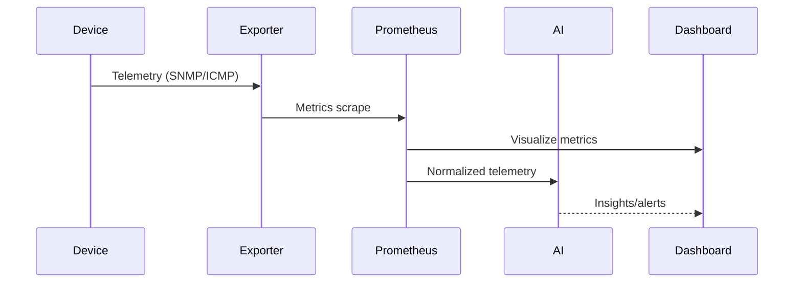

# Telemetry and data flow

This sequence traces telemetry collection from devices through exporters and
Prometheus into AI enrichment and user-facing dashboards. Keep
`docs/diagrams/data-flow.mmd` in sync with pipeline updates.
