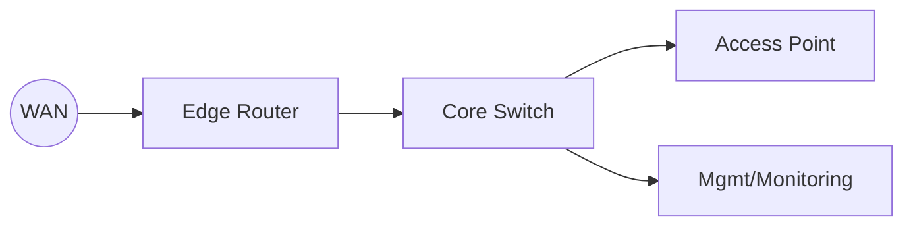

# Network topology

The topology diagram reflects WAN ingress to the edge router, core switching,
and downstream access/management segments. Update `docs/diagrams/topology.mmd`
when device roles or links change.
